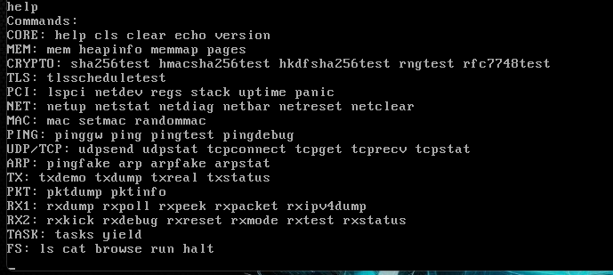
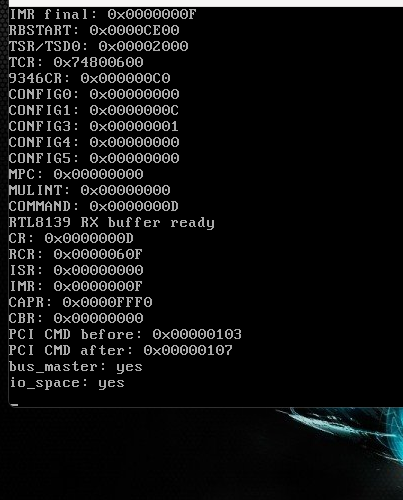
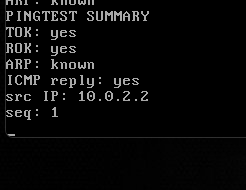
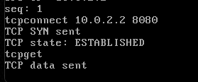
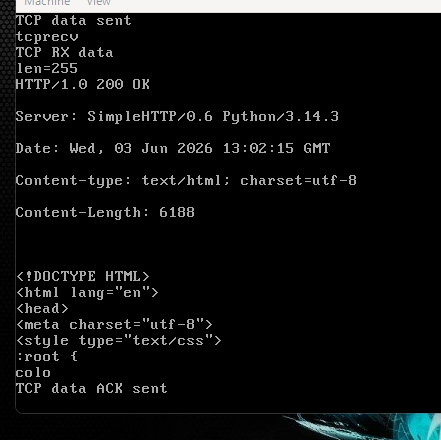
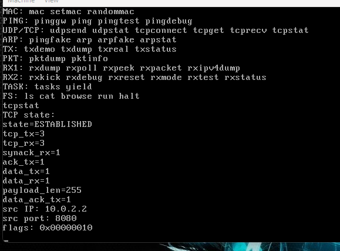

# GhostOS

GhostOS is an experimental x86 operating system written primarily in Assembly, focused on understanding and implementing low-level networking, cryptography, and privacy-oriented protocols from first principles.

The project is developed as a learning and research platform to explore how modern network stacks and cryptographic systems operate beneath traditional operating systems and software frameworks.

---

## Status

| Area                        | Status         |
| --------------------------- | -------------- |
| Bootloader                  | ✅ Working      |
| Protected Mode              | ✅ Working      |
| Memory Foundations          | ✅ Working      |
| FAT12 Loader                | ✅ Working      |
| GEX Programs                | ✅ Working      |
| RTL8139 Driver              | ✅ Working      |
| ARP / IPv4 / ICMP           | ✅ Working      |
| UDP                         | ✅ Working      |
| TCP Client Flow             | ✅ Working      |
| SHA-256                     | ✅ Working      |
| HMAC-SHA256                 | ✅ Working      |
| HKDF-SHA256                 | ✅ Working      |
| RNG                         | ✅ Working      |
| Curve25519 Field Arithmetic | ✅ Working      |
| X25519                      | ✅ Working      |
| TLS Key Schedule Foundations | ✅ Experimental |
| TLS                         | ⬜ Planned      |
| Tor Link Protocol           | ⬜ Planned      |

---

## Current Features

### Core System

* 16-bit bootloader
* Protected Mode (`ghost32`)
* VGA text console
* Interactive shell
* Memory management foundations
* FAT12 filesystem image generation
* GEX executable loading

### Networking

* PCI device discovery
* Realtek RTL8139 driver
* Ethernet frame handling
* ARP protocol
* IPv4 packet processing
* ICMP echo requests and replies
* UDP packet transmission
* TCP SYN / SYN-ACK / ACK handshake
* TCP HTTP payload transmission
* TCP payload receive and ASCII dump
* Multi-segment TCP receive loop
* ACK for received TCP payload data
* TCP FIN receive and close handling
* Packet validation using Wireshark

### Cryptography

#### GhostCrypto v0.1

* SHA-256 implementation
* Standard SHA-256 test vectors

#### GhostCrypto v0.2

* HMAC-SHA256
* ipad/opad processing
* Deterministic validation

#### GhostCrypto v0.3

* Entropy collection
* Pseudo-random number generation

#### GhostCrypto v0.4

##### Curve25519 / X25519

Implemented:

* Private scalar generation
* Private key clamping
* Curve25519 basepoint handling
* Field element buffers
* Field copy/add/subtract helpers
* Multiplication groundwork
* Carry propagation
* Reduction pipeline
* Real reduction modulo 2²⁵⁵−19
* Field squaring
* Field inversion chain
* Montgomery ladder initialization
* Conditional swap (cswap)
* Single ladder step implementation
* 255-bit ladder loop
* Public key generation
* Shared secret generation
* RFC7748 validation
* Deterministic testing infrastructure

#### GhostCrypto v0.5

##### HKDF-SHA256

Implemented:

* HKDF-Extract
* HKDF-Expand
* PRK derivation
* OKM derivation
* RFC5869 Test Case 1 validation
* Deterministic PRK / OKM verification

#### GhostTLS v0.1

##### Key Schedule Foundations

Implemented:

* TLS-style key schedule skeleton
* Early secret derivation
* Handshake secret derivation
* Client handshake traffic secret derivation
* Server handshake traffic secret derivation
* Client application traffic secret placeholder
* Server application traffic secret placeholder
* Deterministic key schedule validation
* `tlsscheduletest` shell command

---

## Development Status

GhostOS is currently in an experimental phase.

The networking stack is functional for low-level communication testing and now includes a minimal TCP client flow over the RTL8139 driver in QEMU user networking.

GhostNet currently supports ARP gateway discovery, ICMP ping testing, TCP connection establishment, HTTP `GET / HTTP/1.0` payload transmission, TCP payload receive/dump, multi-segment receive loops, ACKs for received payload data, and FIN close handling. This has been validated against a local Python HTTP server on `10.0.2.2:8080`.

The cryptographic subsystem now includes RFC7748-validated X25519, RFC5869-validated HKDF-SHA256, and an experimental GhostTLS key schedule foundation. The project is evolving toward TLS record handling, ClientHello generation, and privacy-oriented protocols.

---

## RFC References

The X25519 implementation has been validated against the official test vectors defined in RFC 7748:

* RFC 7748 — Elliptic Curves for Security
* Section 5.2 Test Vectors:
  https://datatracker.ietf.org/doc/html/rfc7748#section-5.2

The HKDF-SHA256 implementation has been validated against RFC 5869 Test Case 1:

* RFC 5869 — HMAC-based Extract-and-Expand Key Derivation Function
* Test Case 1:
  https://datatracker.ietf.org/doc/html/rfc5869#appendix-A.1

GhostOS now matches the RFC7748 X25519 public key/shared secret reference vectors and the RFC5869 HKDF-SHA256 PRK/OKM reference vectors.

---

## Roadmap

### Curve25519 / X25519

* ✅ Real inversion chain
* ✅ RFC7748 validation
* ✅ Public key verification
* ✅ Shared secret verification
* Constant-time refinements

### HKDF-SHA256

* ✅ HKDF-Extract
* ✅ HKDF-Expand
* ✅ RFC5869 validation
* ✅ PRK verification
* ✅ OKM verification

### GhostNet TCP v0.2 — Minimal TCP Client Flow

* ✅ TCP SYN / SYN-ACK / ACK handshake
* ✅ HTTP `GET / HTTP/1.0` payload send
* ✅ TCP payload receive and ASCII dump
* ✅ Multi-segment receive loop
* ✅ ACK received TCP payload data
* ✅ FIN receive and close handling
* Next: TCP robustness refinements and TLS ClientHello transport

### GhostTLS v0.1 — Key Schedule Foundations

* ✅ TLS-style key schedule skeleton
* ✅ Early secret derivation
* ✅ Handshake secret derivation
* ✅ Client handshake traffic secret derivation
* ✅ Server handshake traffic secret derivation
* ✅ Application traffic secret placeholders
* ✅ Deterministic key schedule test

### GhostTLS v0.2 — Record Layer / ClientHello

* TLS Record Layer
* Plaintext record formatting
* ClientHello skeleton
* Key share extension plumbing
* Send ClientHello over the GhostNet TCP flow
* Receive ServerHello / handshake records
* Encrypted Records

### GhostTor

* Tor Link Protocol
* VERSIONS cells
* NETINFO cells
* CREATE2 / CREATED2
* Circuit establishment
* Relay support

---

## Building

Requirements:

* NASM
* Python 3
* QEMU

Build image:

```bash
make img
```

Run:

```bash
make run
```

Or manually:

```bash
nasm -f bin boot/boot.asm -o build/boot.bin
nasm -f bin -w-label-redef-late kernel/kernel.asm -o build/kernel.bin
python tools/mkfat12.py build/ghostos.img build/boot.bin build/kernel.bin
```

---

## Example Commands

```text
help

pingtest
udpsend 10.0.2.2 1234
tcpconnect 10.0.2.2 80
tcpstat

sha256test
hmacsha256test
hkdfsha256test
tlsscheduletest
rngtest
rfc7748test
```

---

## Security Notice

GhostOS is an experimental educational project.

The networking and cryptographic implementations are under active development and must not be considered production-ready or security-audited.

Do not use GhostOS to protect sensitive information, secure communications, or production systems.

---

## License

GhostOS is licensed under the GNU Affero General Public License v3.0 or later (AGPLv3).

---

## Disclaimer

This project is experimental and intended for educational and research purposes only.

It is not production-ready and should not be used in environments where security, privacy, reliability, or legal compliance are required.

The author is not responsible for misuse, damage, data loss, security incidents, or any consequences resulting from the use of this software.

Use at your own risk.

GhostOS does not currently guarantee confidentiality, authenticity, forward secrecy, anonymity, resistance to traffic analysis, or protection against active network attackers.


## Screenshot






